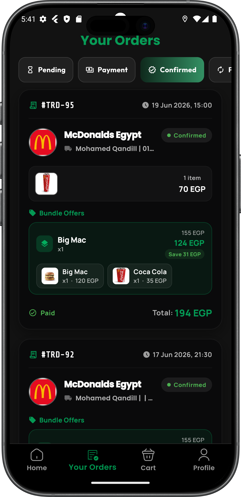

# TradeHub

**TradeHub** is a modern multi-vendor marketplace mobile application built using **Flutter**. It provides a comprehensive ecosystem for customers and vendors, featuring a seamless shopping experience, advanced tracking, and a scalable architecture.

## 🚀 Features

The application implements a wide range of features structured across various modules:

- **Authentication & Security:** Secure login/registration with Firebase Auth, Google Sign-In, and Facebook Auth. Token-based session management using secure storage.
- **Onboarding & Splash:** Smooth introductory screens (Onboarding) and a dynamic Splash screen.
- **Main Layout & Navigation:** A well-structured bottom navigation system encompassing Home, Categories, Favorites, Cart, and Profile.
- **Advanced Product Browsing:** Detailed product views, category filtering, and product ratings/reviews.
- **Vendor Profiles:** Dedicated screens for exploring vendor-specific collections and information.
- **Cart & Checkout:** Smart cart management, offers integration, and a seamless checkout process.
- **Order Management:** Complete order history ("Your Orders"), detailed order views, and real-time order tracking using Google Maps.
- **Maps & Location Services:** Google Maps integration for delivery addresses, order tracking, and store locations.
- **Notifications:** Real-time updates and notifications using SignalR and Local Notifications.
- **Settings & Profile:** Customizable user settings, dark mode support, multi-language localization (Arabic/English), and support section (Get Help / About App).

## 🛠️ Tech Stack & Technologies Used

TradeHub is built adhering to Clean Architecture principles, utilizing modern and powerful tools:

### Framework & Core
- **Flutter & Dart**: Cross-platform mobile development.
- **Bloc / Cubit**: State management for predictable and scalable application states.
- **GetIt & Injectable**: Dependency injection for decoupled architecture.
- **Freezed & Json Serializable**: Data modeling and immutability.

### Networking & API
- **Dio & Retrofit**: Robust HTTP networking and API integration.
- **Pretty Dio Logger**: Detailed network request logging.
- **SignalR Netcore**: Real-time bidirectional communication.

### Storage & Caching
- **Hive & Hive Flutter**: Extremely fast NoSQL local database.
- **Flutter Secure Storage**: Secure storage for authentication tokens.
- **Shared Preferences**: Lightweight local caching.

### UI & Animations
- **Flutter ScreenUtil**: Responsive UI across different screen sizes.
- **Lottie & Flutter Animate**: High-quality, smooth animations.
- **Skeletonizer**: Loading state skeleton animations.
- **Google Fonts**: Custom typography.
- **Awesome Snackbar Content & Animated Snack Bar**: Interactive user feedback messages.
- **Cached Network Image**: Efficient image loading and caching.

### Authentication & Services
- **Firebase Core & Crashlytics**: App analytics and stability monitoring.
- **Firebase Auth, Google Sign In, Flutter Facebook Auth**: Social and email authentication.

### Location & Maps
- **Google Maps Flutter & Location**: Mapping capabilities and user location tracking.

## 📱 Screenshots

Here is a glimpse of the TradeHub mobile application in action:

<p align="center">
  
  
  
</p>
<p align="center">
  
  
  
</p>
<p align="center">
  
  
  
</p>
<p align="center">
  
  
  
</p>
<p align="center">
  
  
  
</p>

## 🚀 Getting Started

1. **Clone the repository:**
   ```bash
   git clone https://github.com/your-repo/tradehub.git
   ```

2. **Install dependencies:**
   ```bash
   flutter pub get
   ```

3. **Run the application:**
   ```bash
   flutter run
   ```
